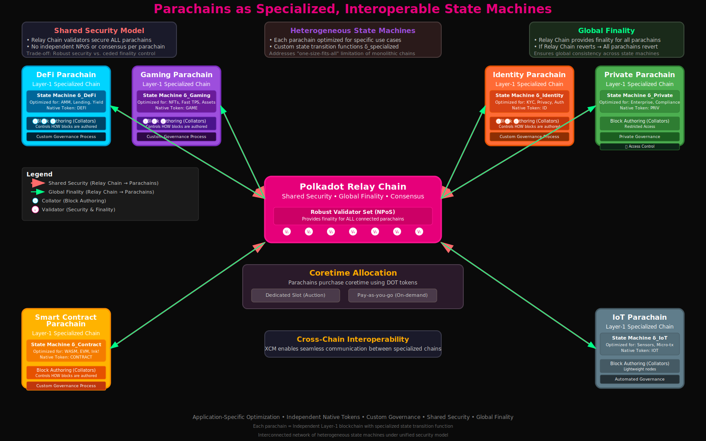

# Parachains as Specialized, Interoperable State Machines

## A. Heterogeneous Layer-1 Blockchains

- Parachains are defined as heterogeneous blockchain shards, operating as independent Layer-1 chains, each equipped with its own native tokens and optimized functionality tailored for specific use cases.
- These parachains are purpose-built and highly specialized, designed to efficiently execute complex logic that is precisely aligned with their intended function. This contrasts with general-purpose smart contract platforms that often struggle to optimize for diverse applications.

- Parachains can be configured as either public or private networks and possess the autonomy to define their own native tokens and governance processes.
- Fundamentally, parachains embody the concept of application-specific state machines. Their heterogeneous nature allows for the optimization of their state transition functions for distinct use cases, such as decentralized finance (DeFi), gaming, or identity management, thereby directly addressing the "one-size-fits-all" limitation prevalent in monolithic blockchain designs.
- This specialization is a powerful mechanism for enhancing scalability and flexibility within the broader Polkadot state machine network.

## B. Shared Security and Coretime Allocation by Connecting to the Relay Chain

- Parachains connect to the Polkadot Relay Chain primarily to benefit from its "shared security," also frequently referred to as "pooled security".
- This shared security model means that the robust validator set of the Polkadot Relay Chain is responsible for securing the state transitions of all connected parachains.
- A critical implication of this design is that if the Relay Chain were to revert for any reason, all connected parachains would also revert, thereby ensuring the persistence and integrity of the entire system.

- A key technical characteristic is that parachains do not operate their own Nominated Proof-of-Stake (NPoS) mechanisms or independent consensus algorithms that provide their own finality.
- Instead, they inherently rely on the Relay Chain for the finalization of their blocks.
- While parachains retain control over how and by whom their blocks are authored (via collators), they cede the ultimate finality mechanism to the Relay Chain. This creates a deeply interconnected and globally consistent state machine network.

- Parachains acquire their connection to the Relay Chain by purchasing "coretime" using DOT tokens
- This can be achieved either by renting a dedicated slot for continuous connectivity, typically through an auction model, or on a more flexible "pay-as-you-go" basis.
- The shared security model presents a huge trade-off: parachains gain robust security from day one without having to bootstrap their own validator sets, but in return, they cede their finality mechanism to the Relay Chain. This ensures global consistency across the network of state machines.

## C. Parachain State Transition Functions and Collator Responsibilities

- Parachains also function as deterministic state machines. Each parachain incorporates its own unique Runtime, which encapsulates its specific state transition function (STF) logic.

- The responsibility for maintaining and progressing a parachain's state falls primarily on **collators**.
- Collators operate full nodes for both their specific parachain and the Polkadot Relay Chain.
- Their key function involves collecting transactions originating from their parachain, executing these transactions locally, and subsequently producing "new block candidates" along with accompanying "state transition proofs" (Proof-of-Validity, or PoV).
- These proofs are cryptographic attestations demonstrating that the parachain's state transitions have strictly adhered to its predefined protocol and logic.

- Collators then submit these block candidates and their corresponding Proof-of-Validity to the Relay Chain validators for verification and eventual inclusion in Polkadot's shared global state.
- The Candidate Backing Subsystem within the Polkadot protocol is specifically tasked with validating these parachain blocks, requiring them to be seconded by at least one parachain validator and ultimately approved by a quorum of validators.
- Collators effectively act as the "proposers" of state transitions for their respective parachain state machines. Their role in generating "state transition proofs" (PoV) is crucial for the Relay Chain's validators to efficiently verify the integrity of these independent state machines without needing to re-execute all transactions themselves.
- This mechanism is how the Relay Chain observes and secures the state changes of its parachains, thereby enabling horizontal scalability across the network.

## D. Parathreads: Flexible, Pay-as-You-Go State Machine Execution

- Parathreads represent a highly flexible and cost-efficient option for blockchains seeking to leverage Polkadot's shared security without committing to the continuous, long-term lease of a full parachain slot.
- They operate on a "pay-as-you-go" model, allowing multiple blockchains to dynamically bid for block space in real-time on a per-block basis.

- Despite their intermittent connectivity, parathreads retain full functionality for cross-chain messaging (XCM) and benefit from the same robust security guarantees provided by Polkadot.
- A significant advantage of parathreads is their inherent flexibility to transition to a full parachain status if a project's activity or economic viability warrants acquiring a dedicated slot.
- Parathreads introduce a dynamic, market-driven allocation of "coretime" for state machine execution. This provides a more granular and economically efficient way for less active or nascent state machines to leverage Polkadot's shared security, fostering a more diverse and adaptable ecosystem by lowering the barrier to entry for participation.
- This mechanism allows for a more flexible "execution model" for state machines, where computational resources are consumed only when needed, optimizing the overall network's capacity.

