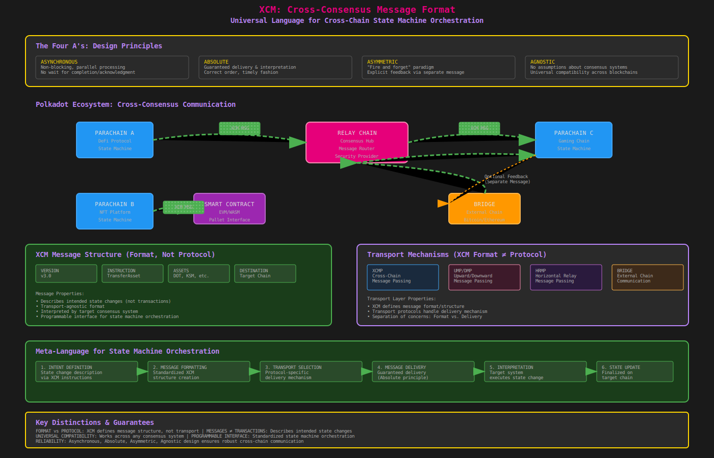

# Cross-Consensus Message Format (XCM)

- The Cross-Consensus Message Format (XCM) serves as the universal "language" or "format" through which complex, cross-consensus interactions occur within the Polkadot ecosystem and beyond.
- XCM enables disparate consensus systems—ranging from different blockchains (parachains), smart contracts, and pallets, to bridges and even sharded enclaves like SPREE—to "speak" to one another in a standardized manner.

- It is crucial to understand that XCM is a format, not a protocol. This distinction implies that XCM defines how messages should be structured, what their content should be, and what on-chain actions they intend to perform, but it does not dictate the underlying transport mechanism or how these messages are delivered.
- Furthermore, XCM messages themselves are not considered transactions.
- Instead, they describe how to effect a change in the state of a target network; the message itself does not directly execute the state change.

## 1. Design Principles: Asynchronous, Absolute, Asymmetric, Agnostic

- XCM's design is underpinned by four crucial high-level principles, known as the "Four A's," which ensure reliable and convenient communication between diverse consensus systems without compatibility issues :

1. Asynchronous: XCM messages do not assume that the sender will wait for their completion or acknowledgment. This non-blocking nature allows for efficient parallel processing and avoids deadlocks in a multi-chain environment.

2. Absolute: XCM messages are guaranteed to be delivered and interpreted accurately, in the correct order, and in a timely fashion. This provides a strong assurance that once a message is sent, it will be processed precisely as intended on the recipient chain.

3. Asymmetric: By default, XCM messages follow a "fire and forget" paradigm, meaning they do not inherently provide a direct response or result to the sender upon receipt. Any desired feedback or outcome must be explicitly communicated back to the origin through a separate, additional message.

4. Agnostic: XCM makes no assumptions about the intrinsic nature of the consensus systems exchanging messages. Its design allows it to be utilized by any system that achieves finality through a consensus mechanism, promoting broad compatibility across the blockchain landscape.

- These principles collectively establish XCM as a meta-language for state machine orchestration.
- It provides a standardized, programmable interface for intending state changes across disparate state machines, without dictating the underlying transport.

| Principle    | Description                                                                      | Implication for Cross-Chain State Transitions                                                                               |
|--------------|----------------------------------------------------------------------------------|-----------------------------------------------------------------------------------------------------------------------------|
| Asynchronous | Sender does not wait for message completion.                                     | Enables parallel execution and high throughput; avoids blocking dependencies between state machines.                        |
| Absolute     | Messages are guaranteed to be delivered and interpreted accurately and in order. | Ensures reliability and trustless execution of intended state changes across different state machines.                      |
| Asymmetric   | "Fire and forget" by default; results require a separate return message.         | Optimises for efficiency by not requiring synchronous responses; allows for flexible feedback mechanisms.                   |
| Agnostic     | No assumptions about the nature of the consensus systems.                        | Promotes universal interoperability; allows XCM to be used across diverse state machines, including those outside Polkadot. |

