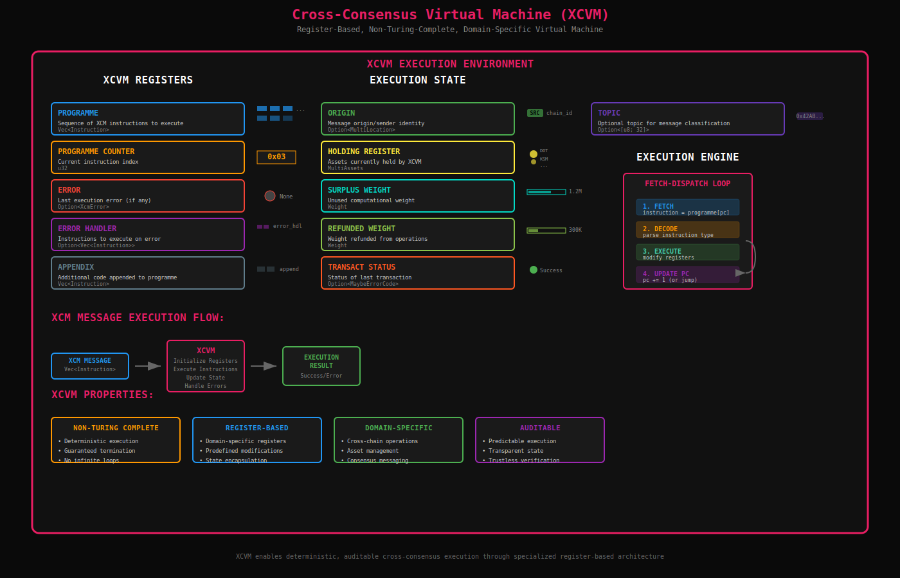

# The Cross-Consensus Virtual Machine (XCVM): Executing XCM Instructions

- At the conceptual core of the XCM format lies the Cross-Consensus Virtual Machine (XCVM).
- This is a highly domain-specific, non-Turing-complete virtual machine.
- XCM messages are essentially "version-aware XCVM programs" or sequences of "one or more XCM instructions".

- The XCVM operates as a register-based machine, though its registers are not general-purpose.
- These registers, such as Programme, Programme Counter, Error, Error Handler, Appendix, Origin, Holding Register, Surplus Weight, Refunded Weight, Transact Status, and Topic, are initialized with specific values and can only be modified under predefined conditions or rules.
- The XCVM functions as a fetch-dispatch loop, executing instructions sequentially until the program completes or encounters an error.
- This design, as a non-Turing-complete, register-based machine, ensures deterministic and auditable execution of cross-consensus instructions, which is critical for achieving trustless interoperability.
- It allows for programmable cross-chain state transitions, ensuring that the logic intended by the sender is interpreted and executed predictably by the recipient state machine.

