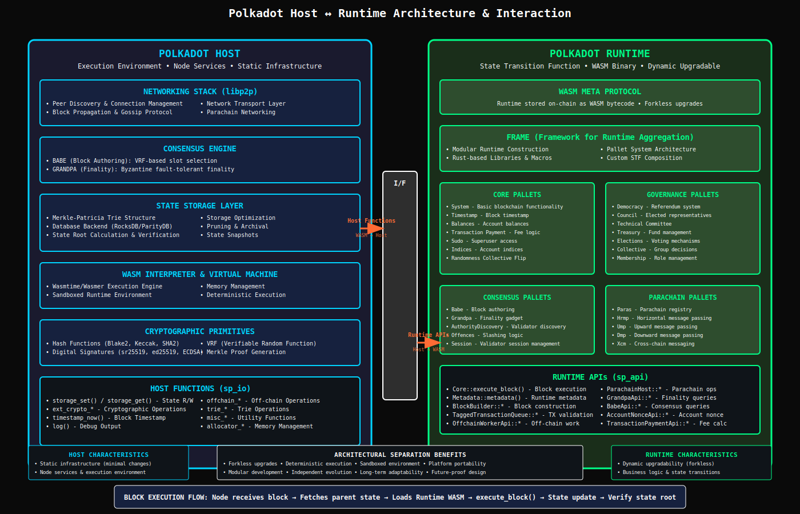

# Polkadot Host and Runtime

- The Polkadot protocol is technically segmented into two principal components:

  - Polkadot Runtime
  - Polkadot Host.

- This architectural separation is fundamental to Polkadot's flexibility and upgradability.

## 1. The Polkadot Runtime: The Deterministic State Transition Function (STF)

- The Polkadot Runtime constitutes the "core state transition logic" of the blockchain.
- It precisely dictates how blocks are processed, defines the criteria for valid and invalid transactions, and determines how the chain's state evolves in response to these transactions.
- Essentially, the Runtime is the canonical encoding of the chain's state transition functions.

### a. Compiled to WebAssembly (WASM)

- A pivotal aspect of the Runtime's design is its compilation into WebAssembly (Wasm) bytecode.
- This Wasm binary is then stored directly as part of the blockchain's storage state. The choice of Wasm is predicated on several critical technical advantages:

  - **Forkless Upgrades**: This is arguably the most significant benefit. Because the Runtime code is embedded within the blockchain's state as Wasm, it can be updated on-chain as part of the state transition function's execution, eliminating the need for disruptive hard forks. This capability ensures continuous operation and significantly reduces the complexities associated with maintaining and upgrading blockchain networks. This approach allows for a dynamic, self-modifying state machine, a powerful capability that enhances long-term adaptability and resilience.

  - **Sandboxed Execution**: Wasm executes in a fully sandboxed environment, providing a secure context for running blockchain logic.

  - **Determinism**: For a blockchain to maintain a consistent global state, its runtime must be 100% deterministic. Wasm guarantees this determinism, ensuring that the same inputs always produce the same outputs across all nodes.

  - **Portability**: Wasm is a platform-neutral, lightweight, and compact bytecode format that runs consistently across diverse hardware and operating systems. This portability is crucial for a decentralized network with validators distributed globally, as it ensures uniform execution regardless of the underlying infrastructure.

  - **Performance**: Wasm is designed for high-performance execution, contributing to the overall efficiency of the Polkadot network.

- The WASM Meta Protocol , which describes this unique architectural design, represents a profound innovation.
- It effectively separates the "business logic" (Runtime) from the "node infrastructure" (Host).
- By storing the Runtime (the state transition function) on-chain as Wasm, Polkadot achieves unprecedented upgradability, allowing the network's core logic to evolve without disruptive hard forks.
- This directly enhances the long-term adaptability and resilience of the Polkadot state machine.

### b. Modularizing Runtime Logic with FRAME and Pallets

- Polkadot's underlying technology, Substrate, leverages the Framework for Runtime Aggregation of Modularized Entities (FRAME) to provide essential building blocks for constructing the blockchain's runtime environment.
- FRAME significantly simplifies the development process by offering a collection of Rust-based libraries and macros that facilitate the creation of custom "pallets" (modules).

- These pallets encapsulate specific behaviors of the protocol, including their associated storage and routines that can alter that storage.
- They also define "entry points" through which new information can be introduced to a module.
- FRAME and its pallet system provide a highly modular and extensible framework for defining a blockchain's state transition function.
- This modularity allows developers to efficiently compose custom, application-specific state machines (parachains), fostering innovation and specialization within the broader Polkadot ecosystem.
- The ability to select and combine pre-built or custom components means that developers can tailor their state machines precisely to their application's needs, rather than being constrained by a rigid, monolithic design.

## 2. The Polkadot Host: The Execution Environment and Node Services

- The Polkadot Host serves as the execution environment for the Polkadot Runtime.
- It provides all the necessary functionalities that enable the Runtime to execute its state transition logic, including the core execution environment, input/output operations, consensus mechanisms, and network interoperability between parachains.

- In contrast to the dynamically upgradable Runtime, the Host is designed to remain stable and largely static throughout Polkadot's operational lifetime.
- The vast majority of protocol changes are intended to be implemented via Runtime updates, minimizing the need for manual software updates and coordination among network participants.
- The Host's components include the networking stack (utilizing libp2p), the state storage layer with its underlying trie structure and database, the consensus engine responsible for BABE and GRANDPA protocols, the Wasm interpreter and virtual machine, and low-level cryptographic primitives such as hash functions.

### a. Interaction between Host and Runtime: Host Functions and Runtime APIs

- The communication between the Node (which embodies the Polkadot Host) and the Runtime occurs through a strictly defined interface, mediated by two primary concepts:

  - **Host functions**: These allow the Wasm runtime to communicate with and request services from the underlying node. Examples include `storage_set` and `storage_get` for reading and writing chain state, `timestamp_now` for accessing the current block timestamp, `ext_crypto_*` for performing cryptographic operations, and `log` for debug output. All host functions are formally defined within the `sp_io` crate.

  - **Runtime APIs**: Conversely, these enable the node to communicate with and query the Wasm runtime. A fundamental example is `sp_api::Core`, which any blockchain must implement to execute blocks.

- When a Substrate-based node executes a block, it receives the block as an opaque blob of data.
- Based on its consensus algorithm, the node decides to import and validate the block.
- It then fetches the state corresponding to the block's parent hash, retrieves the Runtime from this state, and places it into a Wasm execution environment.
- The `sp_api::Core::execute_block` Runtime API is invoked, passing the block as an argument. The Runtime then executes the block, updating the state using the `sp_io::storage` host functions.
- Finally, both the Runtime and the node verify that the resulting state-root matches the one claimed in the block header after execution.

- The strict interface between the Polkadot Host and Runtime, enforced by Host Functions and Runtime APIs, is crucial for enabling forkless upgrades and modularity.
- This separation allows the core infrastructure (Host) to remain stable while the chain's logic (Runtime, which is the state transition function) can evolve dynamically.
- This creates a highly adaptable and future-proof state machine, where changes to the network's behavior can be implemented with minimal disruption.
- The "black box" nature of the Runtime for Host implementers, and the significant commitment required for adding new Host Functions, underscore the deliberate design for stability and independent evolution of these two critical components.

