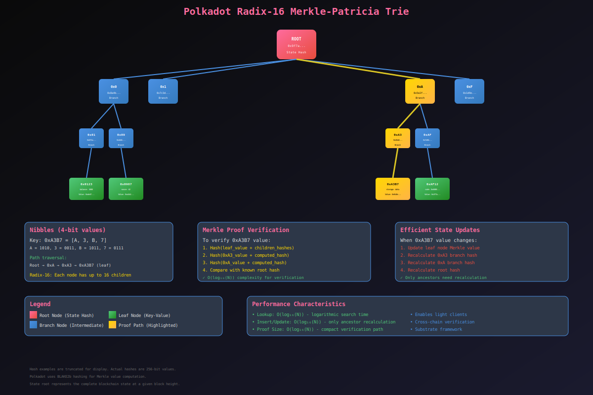

# State Representation: The Radix-16 Merkle-Patricia Trie

- The underlying database layer of Substrate, the framework upon which Polkadot is built, employs a simple key-value storage mechanism augmented by a "modified Patricia Merkle tree".
- This unique structure is fundamental to Polkadot's state management.

## 1. Structure and Properties for Efficient Data Storage

- Polkadot's state storage is specifically implemented as a "radix-16 Merkle-Patricia trie".
- This data structure is designed to efficiently associate keys with values while simultaneously enabling robust verification of data integrity.
- In this tree-like representation, each key-value pair in the blockchain's storage corresponds to a node.
- Every node possesses a "Merkle value," which is a cryptographic digest derived from a combination of the node's own stored value and the Merkle values of all its children. If this combined Merkle value exceeds a certain length, it is hashed to maintain a fixed size.
- Consequently, the Merkle value of any given node is dependent on the storage values of all its descendants.
- This recursive dependency means that the Merkle value of the root node of the entire trie cryptographically summarizes the entirety of the blockchain's state.

- A key advantage of this trie structure is its efficiency in handling state updates.
- When a storage value is modified, only the Merkle values of the affected node and its direct ancestors need to be recalculated, rather than the entire tree.
- This localized recalculation results in logarithmic time complexity for updates, averaging log16(N) operations for a storage with N entries.
- Nodes within the trie are uniquely identified by keys, which are sequences of 4-bit values, known as "nibbles".
- The choice of a radix-16 Merkle-Patricia trie for state representation is a critical technical decision for performance and data integrity.
- Its logarithmic complexity for updates and lookups ensures that the global state machine can evolve efficiently, even with a large number of state entries, which is fundamental for scalability.

## 2. Merkle Proofs

- Merkle proofs are a cryptographic primitive that significantly enhance the efficiency and security of data verification within a Merkle tree structure.
- They enable the efficient verification of specific data blocks within a larger dataset without requiring access to the entire dataset.
- A Merkle proof consists of a concise sequence of hashes that cryptographically link a specific leaf node (representing a data block) to the Merkle root of the tree.

- In the context of Polkadot, if a party knows the Merkle value of the trie's root and wishes to ascertain the storage value associated with a particular node, they can request a third-party to provide the unhashed Merkle values of the desired node and all its ancestors.
- The requesting party can then cryptographically verify these provided values against the known root to confirm the integrity and inclusion of the data.
- A fundamental security property of Merkle trees is that any alteration to a data block will inevitably change its hash, and this change will propagate upwards through the tree, ultimately altering the Merkle root.
- This mechanism provides a robust defense against tampering, as any unauthorized modification becomes immediately detectable.

- Merkle proofs are not merely a cryptographic primitive; they are a fundamental enabler of light client functionality and trustless cross-chain communication within Polkadot's state machine architecture.
- By allowing efficient verification of state subsets, they significantly reduce the computational burden on nodes, particularly light clients, and facilitate secure interactions between different parts of the network without necessitating full state replication.
- This capability is directly relevant to how cross-chain messaging (XCMP) verifies state transitions across different parachains.

