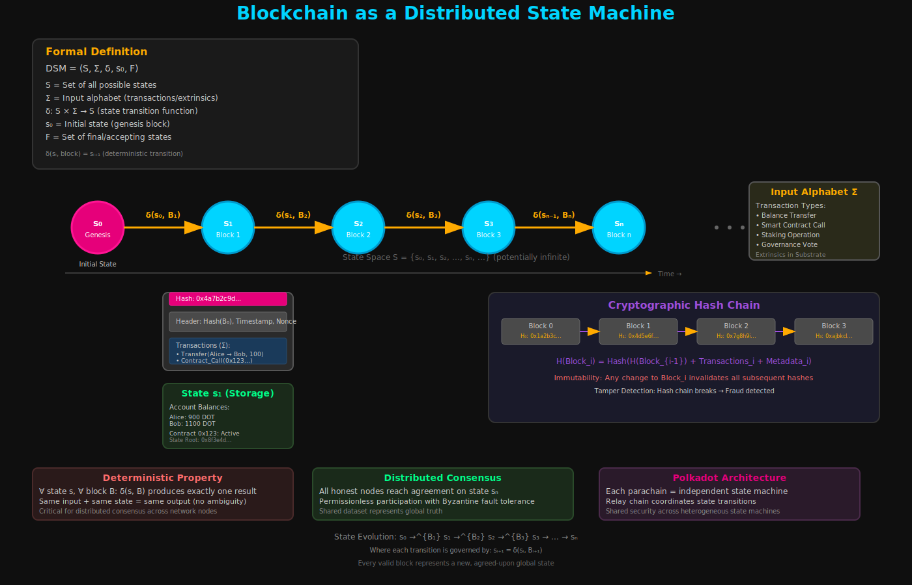

# Blockchain as a State Machine

- At its most fundamental technical level, a blockchain can be precisely understood as a distributed state machine (DSM).

- A blockchain initiates from a defined starting state, often denoted as `s0`.
- It then processes a sequential stream of inputs, typically in the form of transactions or "extrinsics" (`Σ`), and transitions through a countable set of possible states (`S`) via a deterministic state-transition function (`δ`).
- The primary objective of such a distributed system is to enable a permissionless set of participants to collectively agree on a shared dataset, which constitutes the "state" of the blockchain.
- This state is often referred to as "onchain" data or "Storage" within the Substrate framework, storing critical information such as user account balances.

- The evolution of this state occurs through the execution of blocks.
- Each block contains an ordered set of instructions or transactions that, when processed by the state-transition function, deterministically alter the ledger's final state.
- A critical property of blockchain state machines is data immutability, which is enforced through cryptographic hashing.
- If the content of a block is modified in any way, its cryptographic hash will change, consequently altering the hash of all subsequent blocks in the chain.
- This cryptographic linkage creates a tamper-proof history, making any unauthorized alteration immediately detectable and thereby ensuring the integrity of all state transitions.
- The formal definition of a blockchain as a Discrete State Machine is central to understanding Polkadot's architecture, as it shifts the perspective from a mere "chain of blocks" to a system where every valid block represents a new, agreed-upon global state, derived deterministically from the previous state and the block's inputs.

